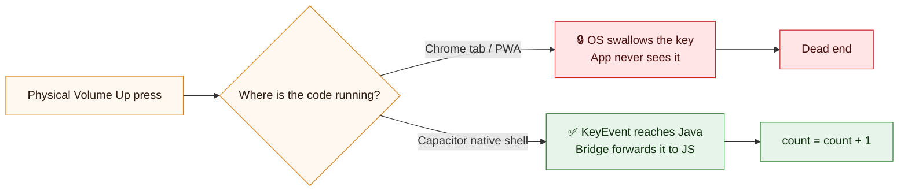
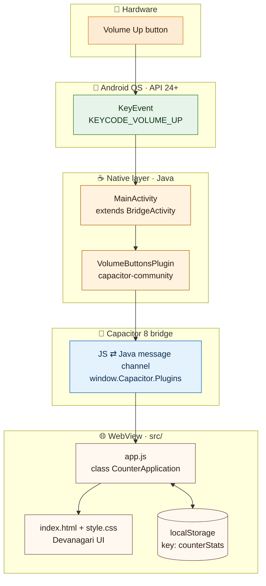
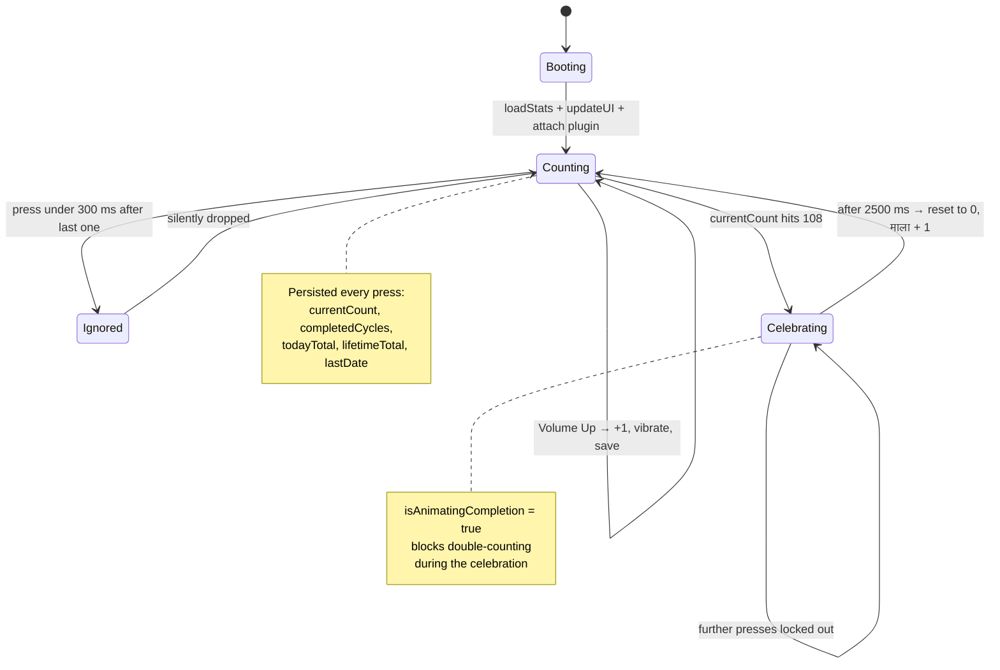
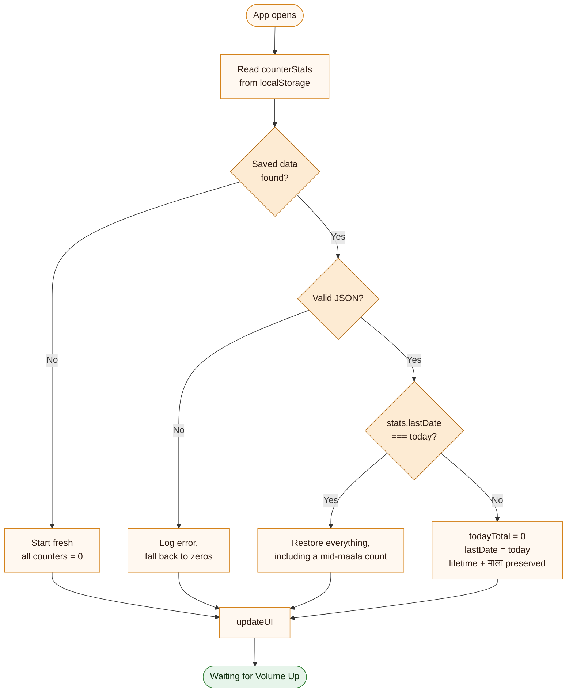
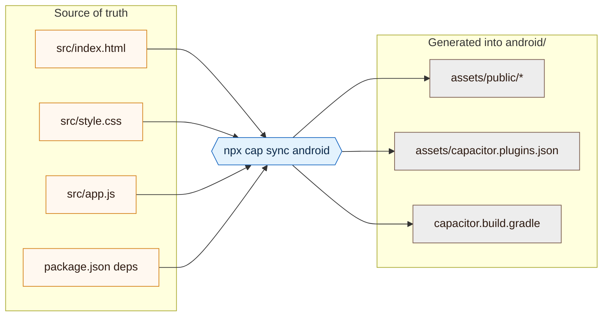
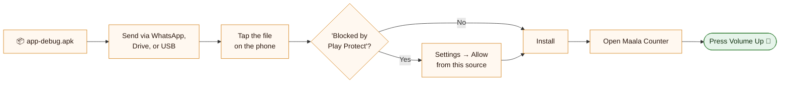

# 🙏 माला काउंटर · Maala Counter

> A dedicated digital prayer counter (mala / tasbih / japa counter) built as a **native Android app** — designed for one user: Dadi.

[](https://github.com/udaysharmadev/Maala-Counter/actions/workflows/android-build.yml)


---

## The One Rule

> ### **Volume Up = +1. That's it.**

No on-screen tap targets. No swipes. No menus. No settings screen. No login. No internet needed.
Just the physical **Volume Up** button on the side of the phone — the one button Dadi already knows how to press without looking at the screen.

The entire interface is in **Hindi (Devanagari)**, with one enormous number and nothing else competing for attention.

```
                    🙏 माला काउंटर

                        27 / 108
                        81 बाकी

                          माला
                            3

                    ● Volume Up सक्रिय
                  बस Volume Up दबाना है.

                  आज: 135      कुल: 4212
```

---

## Why a Native App and Not Just a Website?

This was the core engineering constraint of the whole project. A web page running in Chrome **cannot** read physical volume button presses — Android deliberately blocks this at the OS level, because a web page that could swallow hardware keys would be a security and usability hazard.

| Approach | Volume Up detection | Verdict |
|---|---|---|
| Regular website in Chrome | Blocked by browser + OS | ❌ |
| PWA / "Add to Home Screen" | Still blocked — same sandbox | ❌ |
| Audio-stream hack (poll volume level) | Works until volume hits 0% or 100%, then dead | ❌ Unreliable |
| **Native app via Capacitor** | **Direct `KeyEvent` access in Java** | **✅ Always works** |

The solution: keep the UI as plain web code, but wrap it in a **Capacitor native shell**. Capacitor hands the JavaScript layer a bridge into real Android hardware APIs — so `app.js` gets to listen to a physical key press that no browser would ever hand it.



---

## Architecture

Five layers, from a fingertip on a plastic button all the way to a number rendered on screen.



**Key insight:** `MainActivity.java` is a five-line file. All the app logic lives in web code; the native layer exists purely to grant hardware access.

```java
package com.dadi.maalacounter;

import com.getcapacitor.BridgeActivity;

public class MainActivity extends BridgeActivity {}
```

---

## What Happens on a Single Press

```mermaid
sequenceDiagram
    autonumber
    actor D as Dadi
    participant HW as Volume button
    participant AND as Android OS
    participant P as VolumeButtons plugin
    participant JS as app.js
    participant LS as localStorage
    participant UI as Screen

    Note over JS,P: On boot, app.js polls every 1s until<br/>window.Capacitor.Plugins.VolumeButtons exists,<br/>then registers watchVolume

    D->>HW: press Volume Up
    HW->>AND: KEYCODE_VOLUME_UP
    AND->>P: onKeyDown intercepted
    P->>JS: watchVolume callback, direction = up
    JS->>JS: debounce — ignore if under 300 ms since last press
    JS->>JS: currentCount++, todayTotal++, lifetimeTotal++
    JS->>UI: pulse animation on the big number
    JS->>UI: navigator.vibrate 50 ms
    JS->>LS: saveStats as JSON

    alt currentCount reaches 108
        JS->>UI: show "108 पूर्ण 🙏", vibrate 100-50-100
        JS->>JS: completedCycles++, lock input for 2500 ms
        JS->>LS: persist completed maala
        JS->>UI: after 2500 ms reset counter to 0
    else still counting
        JS->>UI: render new number and "बाकी" remaining
    end
```

---

## Counter State Machine



**Why 108?** A traditional japa mala has 108 beads, so one full cycle of the counter equals one complete maala. It resets itself so Dadi never has to.

---

## Persistence & the Daily Rollover

Everything lives in a single `localStorage` key — `counterStats` — which the Android WebView keeps in the app's private data directory. Nothing leaves the phone.

```json
{
  "currentCount": 27,
  "completedCycles": 3,
  "lifetimeTotal": 4212,
  "todayTotal": 135,
  "lastDate": "Wed Aug 19 2026"
}
```

The one piece of non-obvious logic is the midnight rollover — handled on load, not by a timer, so the app doesn't need to be running at midnight:



If the app is closed mid-maala at 63, it reopens at 63. Lifetime and maala totals survive forever; only "आज" (today) resets on a new calendar day.

---

## Features

- 🔘 **One input, ever** — Volume Up, nothing else
- 🇮🇳 **Fully Hindi UI** — Devanagari labels, Noto Sans Devanagari typeface
- 🪔 **Warm light theme** — cream `#FFF8F0` background, saffron `#D4821A` accent, high contrast, oversized numerals for aging eyes
- 🎉 **Auto-celebration at 108** with a "108 पूर्ण 🙏" message, then auto-reset
- 🛡️ **300 ms debounce** so a shaky double-press never counts twice
- 💾 **Survives restarts** — in-progress count, maala count, today's total, lifetime total
- 🌅 **Automatic daily reset** of today's total on a date change
- ✈️ **Fully offline** — no accounts, no network calls, no analytics, no ads

---

## Tech Stack

| Layer | Technology |
|---|---|
| UI | HTML5 · CSS3 · vanilla JavaScript (zero frameworks, zero build step) |
| Native bridge | [Capacitor 8.5](https://capacitorjs.com/) |
| Volume button | [`@capacitor-community/volume-buttons`](https://github.com/capacitor-community/volume-buttons) 8.0.1 |
| Native entry point | `MainActivity extends BridgeActivity` (Java) |
| Build system | Gradle 8.14.3 · Android Gradle Plugin 8.13.0 |
| JDK | Temurin 21 (required by Capacitor 8) |
| Android SDK | compileSdk / targetSdk **36** · minSdk **24** (Android 7.0+) |
| Storage | `localStorage` inside the app's private WebView data |
| CI/CD | GitHub Actions → downloadable APK artifact |

---

## Project Structure

```
Maala-Counter/
├── src/                                  # ← The entire app lives here
│   ├── index.html                        #   Devanagari UI markup
│   ├── style.css                         #   Warm light theme, pulse animation
│   └── app.js                            #   CounterApplication: plugin, counter, storage
│
├── android/                              # Native shell (generated by Capacitor)
│   ├── app/
│   │   ├── build.gradle                  #   applicationId com.dadi.maalacounter
│   │   └── src/main/
│   │       ├── AndroidManifest.xml        #   Activity + INTERNET permission
│   │       ├── java/com/dadi/maalacounter/
│   │       │   └── MainActivity.java     #   5 lines — just extends BridgeActivity
│   │       ├── res/                      #   Launcher icons, splash, strings
│   │       └── assets/public/            #   ⚠️ generated by `cap sync` — gitignored
│   ├── variables.gradle                  #   SDK + AndroidX versions
│   ├── build.gradle                      #   AGP 8.13.0
│   └── gradle/wrapper/                   #   Gradle 8.14.3
│
├── .github/workflows/
│   └── android-build.yml                 # Cloud build → APK artifact
│
├── capacitor.config.json                 # appId, appName, webDir: "src"
└── package.json                          # 3 runtime deps, 1 dev dep
```

`capacitor.config.json` points `webDir` straight at `src/` — there is no bundler, no transpiler, and no `dist/`. Edit a file, run `cap sync`, rebuild.

---

## Build Pipeline

GitHub Actions is used as a free cloud Android build server. **You do not need Android Studio or the Android SDK on your machine** to produce an installable APK.


Triggered on every push to `main` / `master`, plus manually via **workflow_dispatch**.

### The two commands that matter

**`npx cap sync android`**
Copies `src/*` into `android/app/src/main/assets/public/`, regenerates `capacitor.config.json` / `capacitor.plugins.json` inside the Android project, and registers native plugin classpaths. This is the step that wires `app.js` to `VolumeButtonsPlugin`.



**`./gradlew assembleDebug`**
Android's official build engine: compiles the Java layer, packages the web assets, links AndroidX + Capacitor libraries, and emits one installable file at `android/app/build/outputs/apk/debug/app-debug.apk`.

---

## Download the APK

Every push to `main` builds a fresh APK automatically.

1. Open the [**Actions tab**](https://github.com/udaysharmadev/Maala-Counter/actions)
2. Click the latest successful run ✅
3. Scroll to **Artifacts** → download **`Maala-Counter-APK`**
4. Unzip → you get `app-debug.apk`

---

## Install on the Phone



This is a **debug-signed** APK, so Android will warn about installing from an unknown source — expected for a family app that never went near the Play Store.

---

## Local Development

**Prerequisites:** Node.js 22+, JDK 21. Android Studio only if you want to build locally instead of in CI.

```bash
npm install
```

```bash
npx cap sync android
```

```bash
cd android && ./gradlew assembleDebug
```

Open the native project in Android Studio instead:

```bash
npx cap open android
```

Because `webDir` is `src/` and there is no build step, the edit loop is: change a file in `src/` → `npx cap sync android` → rebuild.

> **Note:** the volume-button plugin only exists inside the native shell. Opening `src/index.html` in a desktop browser renders the UI fine, but `window.Capacitor.Plugins.VolumeButtons` will never appear and `app.js` will keep retrying every second. Counting can only be tested on a real device or emulator.

---

## Security & Privacy

What this app does **not** do: no accounts, no telemetry, no analytics SDK, no ads, no crash reporting, no cloud sync. Counts never leave the device. The only declared permission is `INTERNET`, which Capacitor requires for its WebView plumbing.

What is deliberately **kept out of the repository**:

| Excluded | Why |
|---|---|
| `node_modules/` | Regenerated by `npm ci` in CI |
| `android/local.properties` | Machine-specific SDK path, written fresh by the workflow |
| `android/.gradle/`, `android/app/build/` | Build cache and compiled output |
| `android/app/src/main/assets/public/` | Generated by `cap sync` — `src/` is the source of truth |
| `capacitor.plugins.json`, `capacitor.config.json` (in `assets/`) | Generated by `cap sync` |
| `*.apk` / `*.aab` | Build artifacts — fetched from Actions instead |
| `*.keystore` / `*.jks` | Signing keys must never be committed |

No API keys, tokens, credentials, or personal data exist anywhere in this repository.

---

## Known Limitations

| Limitation | Detail |
|---|---|
| No `VIBRATE` permission declared | `app.js` calls `navigator.vibrate()`, but `AndroidManifest.xml` does not request `android.permission.VIBRATE` — haptic feedback is silently ignored on device. Add the permission (or switch to `@capacitor/haptics`) to enable it. |
| Fonts load from Google Fonts CDN | `index.html` pulls Noto Sans Devanagari over the network. On a fresh install with no connectivity, the UI falls back to a system font. Self-hosting the `.woff2` would make it truly offline-complete. |
| No manual correction | There is intentionally no undo, no reset button, and no way to edit a count. Simplicity was chosen over correctability. |
| Debug signing only | Not Play Store distributable as-is; a release keystore and `assembleRelease` would be needed. |
| Volume Down is unused | Only `direction === 'up'` is handled; Volume Down still changes system volume normally. |

---

## Roadmap Ideas

- [ ] Declare `VIBRATE` so haptic feedback actually fires
- [ ] Self-host the Devanagari font for a 100% offline bundle
- [ ] Optional daily/weekly history view with a streak count
- [ ] Screen-wake lock so the display does not sleep mid-maala
- [ ] Configurable maala size (108 / 27 / 54)
- [ ] Signed release build

---

## Built With ❤️ for Dadi

> *"एक एक दाना, एक एक नाम."*
> *Ek ek daana, ek ek naam.* — one bead, one name.
